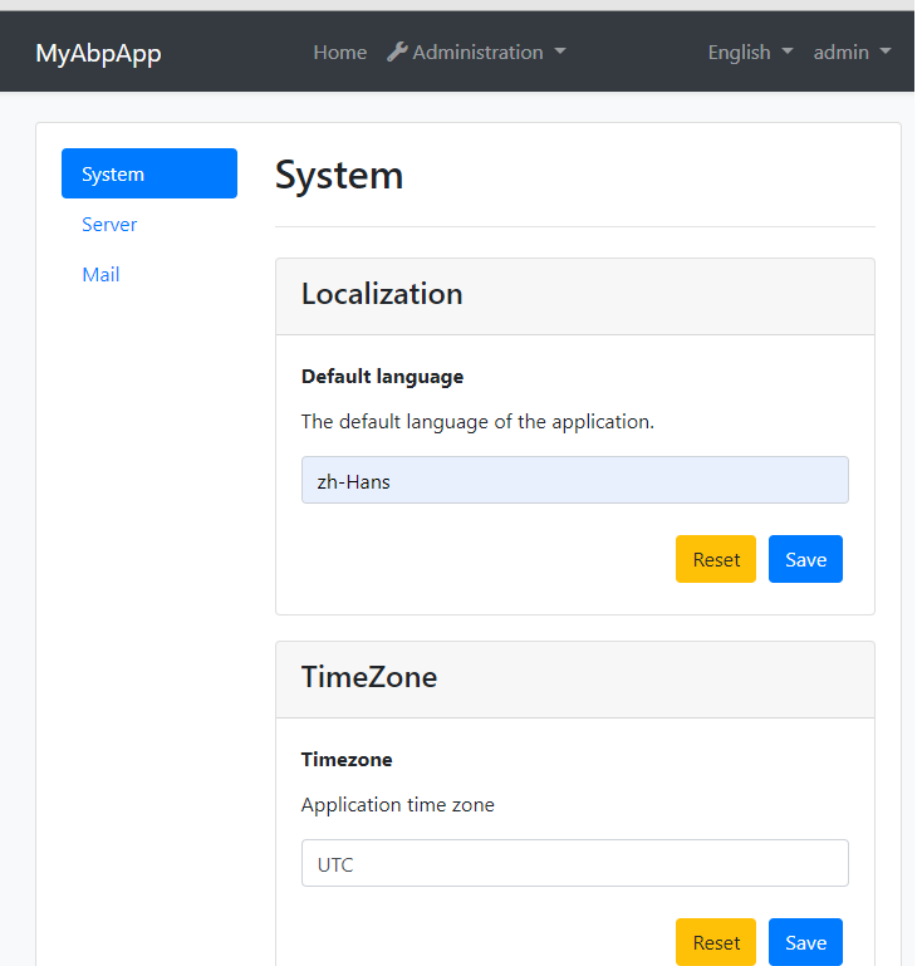
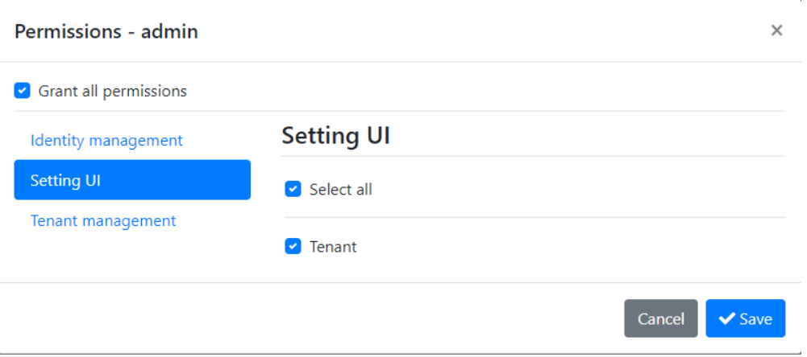

# EasyAbp.Abp.SettingUi

An [ABP](http://abp.io) module used to manage ABP settings



> If you are using ABP version <2.1.1, please see [Abp.SettingManagement.Mvc.UI](https://github.com/wakuflair/Abp.SettingManagement.Mvc.UI)

# Features

* Manage ABP setting values via UI
* Support localization
* Group settings
* Display settings with appropriate input controls

# Getting Started

Here is a step-by-step tutorial to show you the usage of this module.

1. Create an ABP app by using [ABP CLI](https://docs.abp.io/en/abp/latest/CLI)

    `abp new MyAbpApp`

1. Install nuget packages

    There are two packages need to be installed:

    * `MyAbpApp.Application` project:
    
        `Install-Package EasyAbp.Abp.SettingUi.Application`
    
    * `MyAbpApp.Web` project:

        `Install-Package EasyAbp.Abp.SettingUi.Web`

1. Add `DependsOn` attributes

    * `MyAbpApp.Application` project:

        ``` csharp
        ...
        [DependsOn(typeof(SettingUiApplicationModule))]
        public class MyAbpAppApplicationModule : AbpModule
        {
            ...
        }
        ```

    * `MyAbpApp.Web` project:

        ``` csharp
        ...
        [DependsOn(typeof(SettingUiWebModule))]
        public class MyAbpAppWebModule : AbpModule
        {
            ...
        }
        ```

1. Configure auto api controller

    * `MyAbpApp.Web` project:
  
        ``` csharp
        ...
        public class MyAbpAppWebModule : AbpModule
        {
            private void ConfigureAutoApiControllers()
            {
                Configure<AbpAspNetCoreMvcOptions>(options =>
                {
                    ...
                    options.ConventionalControllers.Create(typeof(SettingUiApplicationModule).Assembly);
                });
            }
        }

        ```

1. Run `MyAbpApp.DbMigrator` to seed the database
1. Launch `MyAbpApp.Web`
1. Login with admin/1q2w3E*, then grant permission "Setting UI" - "Global" to admin:

    
  
1. Refresh the browser then you can use "Administration > Settings" menu to see the settings!
            
# Localization

This module uses ABP's localization system to display the localization information of the settings.The languages currently supported are:

* en
* zh-Hans
  
The localization resource files are under `/Localization/SettingUi` of the `EasyAbp.Abp.SettingUi.Domain.Shared` project. 

You can add more resource files to make this module support more languages. Welcome PRs :blush: .
> For ABP's localization system, please see [the document](https://docs.abp.io/en/abp/latest/Localization)

# Setting Properties

* Grouping
* Type

TODO

# Setting renderers

* Adding new renderer
* Customizing existed renderers

TODO

# Roadmap

- [ ] Add more languages
- [ ] Support setting providers
